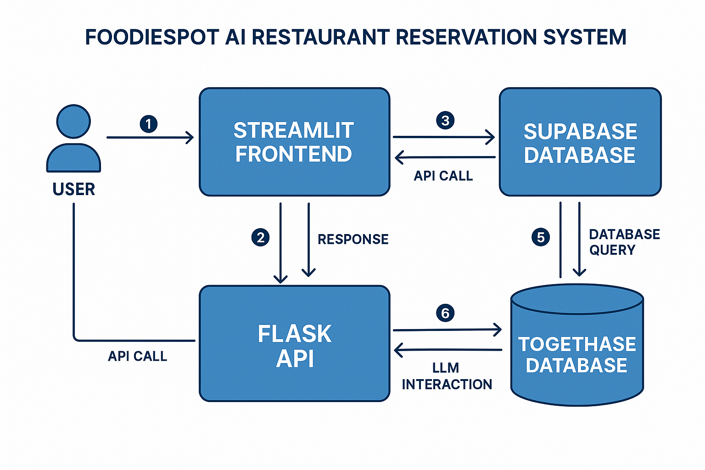

FoodieSpot AI is a conversational restaurant reservation system built with modern web technologies, featuring natural language processing, real-time availability checking, and intelligent recommendations.

# Frontend Layer
```
┌─────────────────────────────────────────┐
│          Streamlit Frontend             │
│  ┌─────────────┐  ┌─────────────────┐   │
│  │ Chat        │  │ Restaurant      │   │
│  │ Interface   │  │ Display Cards   │   │
│  └─────────────┘  └─────────────────┘   │
│  ┌─────────────┐  ┌─────────────────┐   │
│  │ Booking     │  │ Availability    │   │
│  │ Form        │  │ Checker         │   │
│  └─────────────┘  └─────────────────┘   │
└─────────────────────────────────────────┘
```
#Backend Layer

```
┌─────────────────────────────────────────┐
│            Flask Backend                │
│  ┌─────────────┐  ┌─────────────────┐   │
│  │ API         │  │ Business        │   │
│  │ Routes      │  │ Logic           │   │
│  └─────────────┘  └─────────────────┘   │
│  ┌─────────────┐  ┌─────────────────┐   │
│  │ Validation  │  │ Error           │   │
│  │ Layer       │  │ Handling        │   │
│  └─────────────┘  └─────────────────┘   │
└─────────────────────────────────────────┘
```
